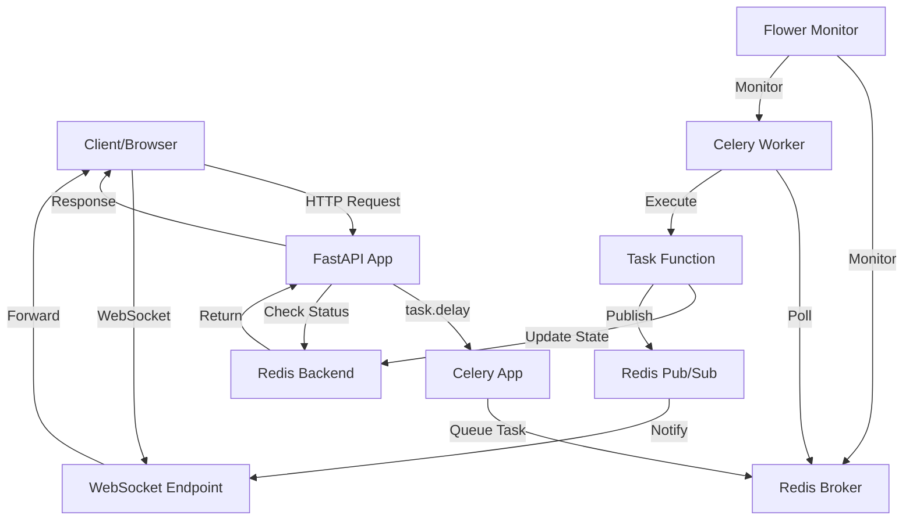

# FastAPI Celery Redis Template

A comprehensive, production-ready template project demonstrating the integration of **FastAPI**, **Celery**, and **Redis** for building high-performance applications with background task processing.

## 📋 Table of Contents

- [Overview](#overview)
- [Features](#features)
- [Architecture](#architecture)
- [Quick Start](#quick-start)
- [Project Structure](#project-structure)
- [API Documentation](#api-documentation)
- [Usage Examples](#usage-examples)
- [Monitoring](#monitoring)
- [Docker Deployment](#docker-deployment)
- [Configuration](#configuration)
- [Troubleshooting](#troubleshooting)

## 🎯 Overview

This template project serves as a complete reference implementation for building modern applications with:

- **FastAPI**: High-performance async web framework
- **Celery**: Distributed task queue for asynchronous job processing
- **Redis**: In-memory data store used as message broker and result backend
- **Flower**: Real-time monitoring tool for Celery tasks

The project demonstrates all core concepts including:
- Basic task execution with status checking
- Progress tracking for long-running tasks
- WebSocket real-time updates
- Direct Redis queue management
- Error handling and retries
- Docker containerization
- Production-ready architecture

## ✨ Features

### 1. Email Service Module
- Send emails asynchronously
- Task status checking
- Automatic retry on failures
- Error handling

### 2. Progress Tracking Module
- Long-running task execution
- Real-time progress updates
- Custom task states
- Progress metadata

### 3. WebSocket Real-Time Updates
- Redis pub/sub integration
- Real-time task completion notifications
- Automatic connection management
- WebSocket endpoint handling

### 4. Queue Management Module
- Direct Redis queue operations
- Queue inspection and monitoring
- Task manipulation
- Queue cleanup utilities

## 🏗️ Architecture



### Component Flow

1. **FastAPI (Producer)**: Receives HTTP requests and creates Celery tasks
2. **Redis (Broker)**: Stores tasks in queues until workers are ready
3. **Celery Worker (Consumer)**: Executes tasks and updates status
4. **Redis (Result Backend)**: Stores task results and status
5. **WebSocket**: Provides real-time updates via Redis pub/sub
6. **Flower**: Monitors tasks and workers in real-time

## 🚀 Quick Start

### Prerequisites

- Python 3.11+
- Redis server
- Docker and Docker Compose (optional)

### Local Setup

1. **Clone or navigate to the project directory**

```bash
cd fastapi_celery_redis_template
```

2. **Install dependencies**

```bash
pip install -r requirements.txt
```

3. **Set up environment variables**

Create a `.env` file (or copy from `.env.example`):

```env
REDIS_URL=redis://localhost:6379/0
CELERY_BROKER_URL=redis://localhost:6379/0
CELERY_RESULT_BACKEND=redis://localhost:6379/0
DEBUG=True
HOST=127.0.0.1
PORT=8000
FLOWER_PORT=5555
```

4. **Start Redis**

```bash
# Using Docker
docker run -d -p 6379:6379 --name redis redis:7-alpine

# Or install and run locally
redis-server
```

5. **Start Celery Worker**

```bash
celery -A worker worker --loglevel=info
```

6. **Start FastAPI Application**

```bash
python -m app.main
# Or
uvicorn app.main:app --reload
```

7. **Start Flower (Optional)**

```bash
celery -A worker flower --port=5555
```

8. **Access the application**

- API: http://localhost:8000
- API Docs: http://localhost:8000/docs
- Flower: http://localhost:5555

### Docker Setup (Recommended)

1. **Build and start all services**

```bash
docker-compose up --build
```

This will start:
- Redis (port 6379)
- FastAPI app (port 8000)
- Celery worker
- Flower (port 5555)

2. **Access services**

- API: http://localhost:8000
- API Docs: http://localhost:8000/docs
- Flower: http://localhost:5555

3. **Stop services**

```bash
docker-compose down
```

## 📁 Project Structure

```
fastapi_celery_redis_template/
├── app/
│   ├── __init__.py
│   ├── main.py                 # FastAPI application entry point
│   ├── config.py               # Configuration management
│   ├── core/
│   │   ├── __init__.py
│   │   ├── celery_app.py      # Celery app initialization
│   │   └── redis_client.py    # Redis client utilities
│   ├── api/
│   │   ├── __init__.py
│   │   └── v1/
│   │       ├── __init__.py
│   │       ├── router.py      # Main API router
│   │       ├── email.py        # Email service endpoints
│   │       ├── progress.py     # Progress tracking endpoints
│   │       ├── websocket.py    # WebSocket endpoints
│   │       └── queue.py        # Queue management endpoints
│   ├── tasks/
│   │   ├── __init__.py
│   │   ├── email_tasks.py      # Email-related Celery tasks
│   │   ├── progress_tasks.py   # Progress tracking tasks
│   │   ├── websocket_tasks.py  # WebSocket notification tasks
│   │   └── queue_tasks.py      # Queue management tasks
│   ├── schemas/
│   │   ├── __init__.py
│   │   ├── email.py           # Email request/response schemas
│   │   ├── progress.py        # Progress schemas
│   │   ├── websocket.py       # WebSocket schemas
│   │   └── queue.py           # Queue schemas
│   └── utils/
│       ├── __init__.py
│       └── queue_manager.py   # Redis queue management utilities
├── worker.py                   # Celery worker entry point
├── docker-compose.yml          # Docker Compose configuration
├── Dockerfile                  # Application Dockerfile
├── .env.example               # Environment variables template
├── pyproject.toml             # Project dependencies
├── requirements.txt           # Python dependencies
├── example_client.html        # Example HTML client for testing
└── README.md                  # This file
```

## 📚 API Documentation

### Email Service

#### Send Email
```http
POST /api/v1/email/send
Content-Type: application/json

{
  "to": "user@example.com",
  "subject": "Hello",
  "body": "Test email"
}
```

**Response:**
```json
{
  "task_id": "abc-123-def",
  "status": "PENDING",
  "message": "Email queued for sending"
}
```

#### Check Email Status
```http
GET /api/v1/email/status/{task_id}
```

**Response:**
```json
{
  "task_id": "abc-123-def",
  "status": "SUCCESS",
  "result": "Email sent successfully to user@example.com"
}
```

### Progress Tracking

#### Process File
```http
POST /api/v1/progress/process-file
Content-Type: application/json

{
  "file_path": "/data/example.txt",
  "file_size": 20
}
```

**Response:**
```json
{
  "task_id": "xyz-789-abc",
  "status": "PENDING",
  "message": "File processing started for /data/example.txt"
}
```

#### Check Progress
```http
GET /api/v1/progress/status/{task_id}
```

**Response:**
```json
{
  "task_id": "xyz-789-abc",
  "status": "PROGRESS",
  "progress": {
    "current": 5,
    "total": 20,
    "percent": 25,
    "status": "Processing step 5/20"
  }
}
```

### WebSocket Real-Time Updates

#### Generate Report
```http
POST /api/v1/websocket/generate-report
Content-Type: application/json

{
  "report_type": "monthly",
  "parameters": {}
}
```

**Response:**
```json
{
  "job_id": "report-123",
  "status": "queued",
  "websocket_url": "/api/v1/websocket/ws/report-123"
}
```

#### WebSocket Connection
```javascript
const ws = new WebSocket('ws://localhost:8000/api/v1/websocket/ws/report-123');

ws.onmessage = (event) => {
  const data = JSON.parse(event.data);
  console.log('Status:', data.status);
  if (data.status === 'completed') {
    console.log('Download URL:', data.download_url);
  }
};
```

### Queue Management

#### Push Task to Queue
```http
POST /api/v1/queue/push
Content-Type: application/json

{
  "queue_name": "my_queue",
  "task_data": {
    "action": "process",
    "data": "test"
  }
}
```

#### Get Queue Info
```http
GET /api/v1/queue/info/{queue_name}?limit=10
```

#### Clear Queue
```http
DELETE /api/v1/queue/clear/{queue_name}
```

## 💡 Usage Examples

### Example 1: Send Email

```python
import requests

# Send email
response = requests.post(
    "http://localhost:8000/api/v1/email/send",
    json={
        "to": "user@example.com",
        "subject": "Hello",
        "body": "Test email"
    }
)
task_id = response.json()["task_id"]

# Check status
status_response = requests.get(
    f"http://localhost:8000/api/v1/email/status/{task_id}"
)
print(status_response.json())
```

### Example 2: Process File with Progress

```python
import requests
import time

# Start processing
response = requests.post(
    "http://localhost:8000/api/v1/progress/process-file",
    json={
        "file_path": "/data/example.txt",
        "file_size": 20
    }
)
task_id = response.json()["task_id"]

# Poll for progress
while True:
    status = requests.get(
        f"http://localhost:8000/api/v1/progress/status/{task_id}"
    ).json()
    
    if status["status"] == "PROGRESS":
        progress = status["progress"]
        print(f"Progress: {progress['percent']}%")
    elif status["status"] == "SUCCESS":
        print("Completed!", status["result"])
        break
    elif status["status"] == "FAILURE":
        print("Failed!", status["error"])
        break
    
    time.sleep(1)
```

### Example 3: WebSocket Real-Time Updates

```javascript
// Generate report
const response = await fetch('http://localhost:8000/api/v1/websocket/generate-report', {
  method: 'POST',
  headers: {'Content-Type': 'application/json'},
  body: JSON.stringify({report_type: 'monthly'})
});

const {job_id} = await response.json();

// Connect WebSocket
const ws = new WebSocket(`ws://localhost:8000/api/v1/websocket/ws/${job_id}`);

ws.onmessage = (event) => {
  const data = JSON.parse(event.data);
  if (data.status === 'completed') {
    console.log('Report ready:', data.download_url);
    ws.close();
  }
};
```

### Example 4: Using the HTML Client

Open `example_client.html` in your browser. This interactive client demonstrates all features:

- Email service with status checking
- Progress tracking with visual progress bar
- WebSocket real-time updates
- Queue management operations

## 📊 Monitoring

### Flower Dashboard

Flower provides a web-based interface for monitoring Celery tasks:

1. **Access Flower**: http://localhost:5555
2. **Features**:
   - View active, succeeded, and failed tasks
   - Monitor worker health and performance
   - Track task execution time
   - View task details, arguments, and results
   - Monitor queue lengths

### Health Checks

```http
GET /health
```

Returns application health status.

## 🐳 Docker Deployment

### Using Docker Compose

The `docker-compose.yml` file includes all services:

```bash
# Start all services
docker-compose up -d

# View logs
docker-compose logs -f

# Stop all services
docker-compose down

# Rebuild and restart
docker-compose up --build
```

### Services

- **redis**: Redis server (port 6379)
- **app**: FastAPI application (port 8000)
- **worker**: Celery worker
- **flower**: Flower monitoring (port 5555)

All services are connected via Docker network and configured with health checks.

## ⚙️ Configuration

### Environment Variables

| Variable | Description | Default |
|----------|-------------|---------|
| `REDIS_URL` | Redis connection URL | `redis://localhost:6379/0` |
| `CELERY_BROKER_URL` | Celery broker URL | Same as `REDIS_URL` |
| `CELERY_RESULT_BACKEND` | Celery result backend URL | Same as `REDIS_URL` |
| `DEBUG` | Enable debug mode | `True` |
| `HOST` | Application host | `127.0.0.1` |
| `PORT` | Application port | `8000` |
| `FLOWER_PORT` | Flower port | `5555` |
| `TASK_TIME_LIMIT` | Task hard time limit (seconds) | `1800` |
| `TASK_SOFT_TIME_LIMIT` | Task soft time limit (seconds) | `1500` |

### Celery Configuration

Celery is configured in `app/core/celery_app.py`:

- Task serialization: JSON
- Result expiration: 1 hour
- Task tracking: Enabled
- Worker prefetch: 1 (fair distribution)
- Max tasks per child: 1000

## 🔧 Troubleshooting

### Tasks Not Executing

1. **Check if worker is running**:
   ```bash
   celery -A worker inspect active
   ```

2. **Verify Redis connection**:
   ```bash
   redis-cli ping
   ```

3. **Check worker logs**:
   ```bash
   celery -A worker worker --loglevel=debug
   ```

### Tasks Stuck in PENDING

- Ensure worker is running
- Check Redis connection
- Verify task name matches worker registration
- Check queue name matches worker queue

### WebSocket Not Connecting

- Ensure FastAPI app is running
- Check WebSocket endpoint URL
- Verify Redis pub/sub is working
- Check browser console for errors

### Docker Issues

- Ensure Docker and Docker Compose are installed
- Check if ports are already in use
- Review `docker-compose logs` for errors
- Verify `.env` file is configured correctly

## 📖 Additional Resources

- [FastAPI Documentation](https://fastapi.tiangolo.com/)
- [Celery Documentation](https://docs.celeryq.dev/)
- [Redis Documentation](https://redis.io/docs/)
- [Flower Documentation](https://flower.readthedocs.io/)

## 🎓 Learning Path

This template demonstrates:

1. **Basic Concepts**: Email service shows fundamental task execution
2. **Progress Tracking**: File processing demonstrates state updates
3. **Real-Time Updates**: WebSocket module shows pub/sub pattern
4. **Queue Management**: Direct Redis operations for advanced use cases

Each module is self-contained and can be studied independently.

## 📝 License

This template is provided as-is for educational and reference purposes.

## 🤝 Contributing

This is a template project. Feel free to use it as a starting point for your own projects!

---

**Happy Coding!** 🚀
